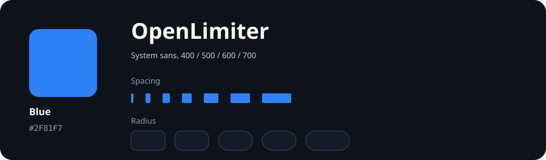
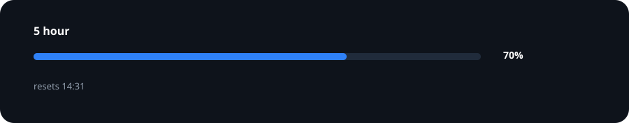

# OpenLimiter brand

The logo is frozen. Changing the canonical lockup fails CI until the manifest is regenerated, and requires the owner’s explicit approval recorded in the commit message.

Every shipped surface uses the visual contract in `packages/ui/src/tokens.css`. Components consume tokens. They do not copy colors, radii, spacing or type values.

## Identity

The identity is the exact site header lockup recovered from commit `38c96fd`: the eight segment blue mark plus its Baloo 2 SemiBold OpenLimiter wordmark. The font is embedded in the canonical SVG. Use the full lockup on named surfaces. Use only the bare symbol derived from that same artwork in square icon contexts: favicon, PWA, window, installer and tray. Never redraw, rotate, recolor or retype it.

## System

The product palette is black, white, gray and the canonical blue. Provider marks may use their verified provider colors. Typography uses the system sans stack. Spacing follows the 4, 8, 12, 16, 24, 32 and 48 pixel rhythm. Radius follows the 8, 12, 16, 20 and 24 pixel scale, with the pill token reserved for meters and compact controls.

## Meter anatomy

A usage window contains exactly the window name, bar, percentage and reset time. The track uses `--ol-track`, the fill uses the meter token, and both use `--ol-meter-radius`. Labels, values and reset text use the shared type and spacing scale.

Provider artwork follows the official references from [Google Antigravity](https://antigravity.google.com/), [Google Gemini](https://deepmind.google/models/gemini/), [xAI](https://x.ai/legal/brand-guidelines) and [Kimi](https://www.kimi.com/pt-br/resources/kimi-brand).
