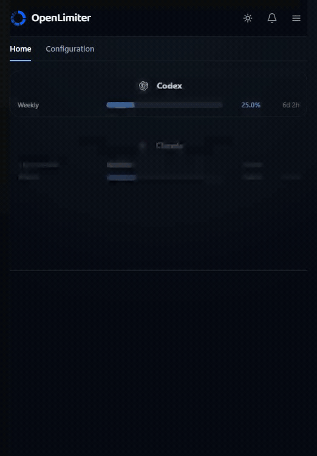

# OpenLimiter

  

OpenLimiter shows the quota windows from the AI tools already signed in on your computer. It keeps each provider and account separate, stays beside the clock on Windows and Linux, and never invents a missing number.

  

Current desktop renderer reading a real local cache on 24 August 2026. Account identifiers were replaced with local provider aliases. Percentages and reset times were not changed.

[Download for Windows or Linux](https://openlimiter.com/download)

## What ships

1. Automatic local readers for Claude Code, Codex, Antigravity, Gemini CLI, Grok, and Kimi.

2. One line per documented quota window, grouped under its configured provider.

3. Desktop, tray, command line, statusline, and bounded coding agent context surfaces.

4. A free OpenLimiter account with current percentage sync to the web dashboard and phone PWA. Sync defaults on after sign in and has a clear off switch.

5. Free local operating system notifications at 60, 75, and 90 percent. Reset notifications remain off by default.

  

## Privacy boundary

The local product is free forever and has zero analytics or tracking. Local readers open known authentication locations and send the existing token only to that provider usage interface. OpenLimiter never writes to provider authentication files.

Only bounded usage percentages, reset times, opaque account labels, and an opaque device identifier can enter free sync. Provider credentials, response bodies, prompts, source code, local configuration, and diagnostics never enter the OpenLimiter service.

Signing out stops remote access. It does not delete or disable the local cache, connectors, tray, notifications, command line tools, or local advice.

## Verification status

Every connector remains labelled `UNVERIFIED` until its reviewed registry evidence meets the project verification contract. Codex and Antigravity have been read against real accounts on this machine. Their interfaces are private and can still drift. Claude, Gemini CLI, Grok, Kimi, OpenRouter, and OpenCode have the narrower evidence described in [the provider research](provider_specs/RESEARCH.md).

When any response fails its expected contract, that provider becomes unknown. OpenLimiter never repairs, estimates, or substitutes a percentage.

## Agent context

OpenLimiter can render a bounded `PREFER` recommendation into coding agent context. It is advice. It cannot execute, authenticate, spend quota, change a plan, or redirect a request, and the coding agent may ignore it.

## Free core and planned Pro services

The complete local product is open source under Apache 2.0. Free includes every local reader, meter, notification, command line feature, statusline, local context block, dark and light themes, and current percentage sync.

OpenLimiter Pro is not available for purchase yet. The planned price is 5 dollars per month or 50 dollars per year. The planned deliverables are email and phone push notifications, token based theme variants, more than one subscription per provider, heavy API usage features, history and forecasting, and hosted agent routing context. Checkout remains unavailable while any launch requirement is incomplete. No local feature moves behind payment.

## Build and contribute

The repository pins Node 24.15.0 and pnpm 9.15.0. The Rust desktop uses the stable toolchain. Start with [CONTRIBUTING.md](CONTRIBUTING.md), and never include a real credential, provider response, account identifier, or machine path in an issue or fixture.

## Availability

Windows and Linux builds ship. They are unsigned, so Windows shows a SmartScreen warning. macOS is not available because Gatekeeper blocks an unsigned application.

## Project links

[Source](https://github.com/lucaswebsystems/openlimiter)

[Release notes](docs/RELEASE_NOTES_1.0.md)

[Honest comparison](docs/COMPARISON.md)

[Security](SECURITY.md)

[Pro boundary](PRO.md)

[License](LICENSE)
