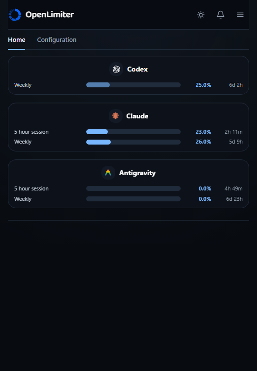

# OpenLimiter

  

OpenLimiter shows the quota windows from the AI tools already signed in on your computer, right where you already look: your terminal, your tray, your phone. It keeps each provider and account separate and never invents a missing number.

  

Current desktop renderer reading a real local cache. Account identifiers were replaced with local provider aliases. Percentages and reset times were not changed.

[Download for Windows, macOS, or Linux](https://openlimiter.com/download)

## Get started

Bars are free and need no account. Run `npx openlimiter`, or install it with `npm install -g openlimiter` and run `openlimiter`: it walks the same three steps everywhere, sign in, connect, show bars in, and any step you skip stays skipped. The desktop app's first run is the same three steps in its own window. The hub at [openlimiter.com/app](https://openlimiter.com/app) is account first: sign in, connect, bars.

An account only adds sync, current percentages kept current between your devices. Pro adds history, alerts, the phone, more than one account per provider, and cloud metering for API spend keys, with a 30 day free trial and no card required.

## Terminal

Claude Code, Grok Build and the Antigravity CLI draw bars through their own status line. Codex draws its own built in items instead. Gemini CLI, OpenCode, Kimi and any other terminal read a shell prompt segment. `openlimiter terminal` wires whichever hosts a machine supports, and `openlimiter terminal show` and `terminal hide` pick which connected providers actually draw a bar.

## Connect

Every provider is read from the login its own tool already stored on disk. Codex can also sign in from inside OpenLimiter. Claude reads what Claude Code reports, with an opt in poll of Anthropic's own endpoint for when Claude Code is closed. Gemini CLI and Antigravity are read only, with a plain disclosure sentence in the row. OpenRouter signs in with real OAuth from the hub. API spend keys live in this device's keyring, or, with opt in cloud metering, encrypted on the server.

OpenLimiter never asks for a vendor password, never impersonates a vendor tool, and never uploads a token. Every request identifies itself as OpenLimiter.

## Phone

Pair from the hub with a QR code, nothing typed. Add it to your home screen from there: Android offers to install it, and iOS uses Share, then Add to Home Screen.

## Privacy boundary

The local product is free forever and has zero analytics or tracking. Local readers open known authentication locations and send the existing token only to that provider's own usage interface. OpenLimiter never writes to a provider's authentication files. Only bounded usage percentages, reset times, opaque account labels and an opaque device identifier can enter sync. Provider credentials, response bodies, prompts, source code and local configuration never enter the OpenLimiter service. Signing out stops remote access; it never touches the local cache, connectors, tray, or command line tools.

## Verification status

Every connector remains labelled `UNVERIFIED` until its reviewed registry evidence meets the project verification contract. When a response fails its expected contract, that provider becomes unknown rather than repaired, estimated, or substituted.

## Free core and Pro

The complete local product is open source under Apache 2.0. Free includes every local reader, meter, the terminal bars, the tray, the command line tool, and current percentage sync.

OpenLimiter Pro costs 5 US dollars a month or 50 US dollars a year, with a 30 day free trial and no card required. It adds history, alerts, the phone, more than one account per provider, and cloud metering for API spend keys. Checkout runs through Stripe, which acts as the payment processor. A full refund is available on request within 14 days of any charge. No local feature ever moves behind payment.

## Build and contribute

The repository pins Node 24.15.0 and pnpm 9.15.0. The Rust desktop uses the stable toolchain. Start with [CONTRIBUTING.md](CONTRIBUTING.md), and never include a real credential, provider response, account identifier, or machine path in an issue or fixture.

## Availability

Windows, macOS and Linux builds ship, all unsigned for now. On Windows, SmartScreen: choose More info, then Run anyway. On macOS: open the app once, then System Settings, Privacy and Security, Open Anyway.

## Project links

[Source](https://github.com/lucaswebsystems/openlimiter)

[Documentation](https://openlimiter.com/docs)

[Release notes](docs/RELEASE_NOTES_1.0.md)

[Honest comparison](docs/COMPARISON.md)

[Security](SECURITY.md)

[Pro boundary](PRO.md)

[License](LICENSE)
