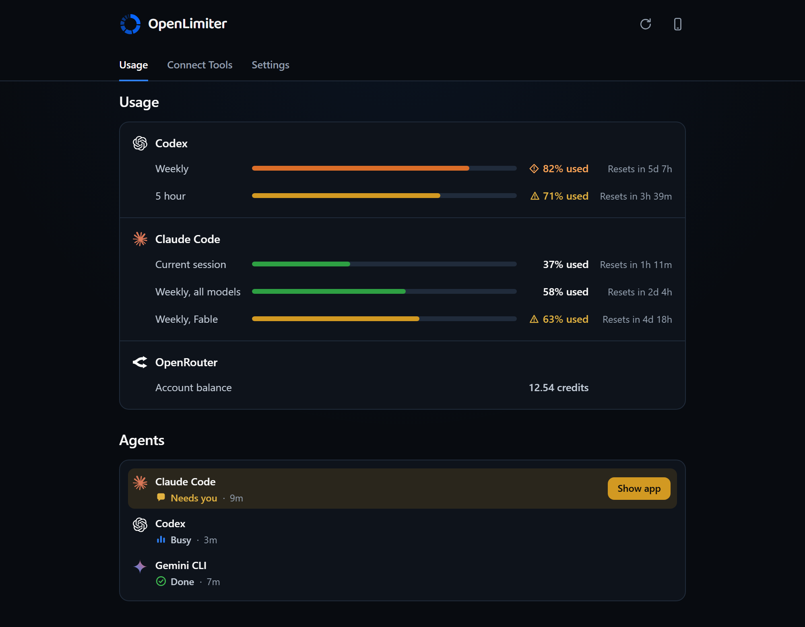

# OpenLimiter

<p align="center">
  
</p>

OpenLimiter 2.0 reads usage limits and agent activity from supported AI tools on your computer and shows them in a small tab at the edge of your desktop, the tray, your terminal, your browser and your phone.

<p align="center">
  
</p>

<p align="center"><sub>Current desktop renderer with synthetic fixtures for provider meters and local agent activity. No account identifiers or real usage data are included.</sub></p>

[](https://github.com/lucaswebsystems/openlimiter/releases/latest/download/OpenLimiter-windows-x64-setup.exe)
[](https://github.com/lucaswebsystems/openlimiter/releases/latest/download/OpenLimiter-macos-universal.dmg)
[](https://github.com/lucaswebsystems/openlimiter/releases/latest/download/OpenLimiter-linux-x86_64.AppImage)

[All download formats](https://openlimiter.com/download)

```sh
npm install -g openlimiter
```

## Get started

Bars are free and need no account. Run `npx openlimiter`, or install it with `npm install -g openlimiter` and run `openlimiter`: it walks the same three steps everywhere, sign in, connect, show bars in, and any step you skip stays skipped. The desktop app's first run is the same three steps in its own window. The hub at [openlimiter.com/app](https://openlimiter.com/app) is account first: sign in, connect, bars.

Local meters, agent activity and desktop alerts are free, with one active account per provider and no local monthly spend cap. An account adds current reading sync across your devices, including your browser and phone. Pro adds history, remote alerts, more than one account per provider and opt in cloud metering for API spend keys, with a 30 day free trial and no card required.

## Terminal

Claude Code, Grok Build and the Antigravity CLI draw bars through their own status line. Codex draws its own built in items instead. Gemini CLI, OpenCode, Kimi and any other terminal read a shell prompt segment. The status line uses the same band colours as the meters. `openlimiter terminal` wires whichever hosts a machine supports, and `openlimiter terminal show` and `terminal hide` pick which connected providers actually draw a bar.

## Connect

Every provider is read from the login its own tool already stored on disk. Codex can also sign in from inside OpenLimiter. Claude reads what Claude Code reports. On a new desktop install, Claude usage is on after it is disclosed and recorded before the first request. An existing desktop install is asked once before any request. The terminal asks once when attended, or stays off when unattended. The desktop Show Fable limit switch controls requests from the desktop process. Stop it in Settings by turning Show Fable limit off. The separate `providers.claude.poll` setting controls the command line process. Stop it with `openlimiter config set providers.claude.poll false`. Either can be turned off without changing the other. Gemini CLI and Antigravity are read only, with a plain disclosure sentence in the row. OpenRouter signs in with real OAuth from the hub. API spend keys live in this device's keyring, or, with opt in cloud metering, encrypted on the server.

Claude usage requests go directly to the usage endpoint with the local Claude credentials on this computer. Anthropic's policy for tools like this is unresolved.

OpenLimiter never asks for a vendor password, never impersonates a vendor tool, and never uploads a token. Every request identifies itself as OpenLimiter.

## Phone

Pair from the hub with a QR code, nothing typed. Add it to your home screen from there: Android offers to install it, and iOS uses Share, then Add to Home Screen.

## Privacy boundary

The local product is free forever and has zero analytics or tracking. Local readers open known authentication locations and send the existing token only to that provider's own usage interface. OpenLimiter never writes to a provider's authentication files. Only bounded usage percentages, reset times, opaque account labels and an opaque device identifier can enter sync. Provider credentials, response bodies, prompts, source code and local configuration never enter the OpenLimiter service. Signing out stops remote access; it never touches the local cache, connectors, tray, or command line tools.

## Verification status

Every connector remains labelled `UNVERIFIED` until its reviewed registry evidence meets the project verification contract. When a response fails its expected contract, that provider becomes unknown rather than repaired, estimated, or substituted.

Cursor is Experimental until live account verification is complete. The edge tab works the same on Windows, macOS and Linux X11; on Linux Wayland, which cannot place it, the tray takes its place. A phone shows the latest synchronized reading, which can be stale when its computer is offline.

## Free core and Pro

The complete local product is open source under Apache 2.0. Free includes local readers and meters, the edge tab, agent activity, local alerts, terminal bars, the tray, the command line tool and current reading sync to the browser and phone. Free keeps one active account per provider. Local spend readings have no monthly cap.

OpenLimiter Pro costs 5 US dollars a month or 50 US dollars a year, with a 30 day free trial and no card required. It adds history, remote alerts, more than one account per provider and opt in cloud metering for API spend keys. Checkout runs through Stripe, which acts as the payment processor. A full refund is available on request within 14 days of any charge. Local meters and local alerts remain available after a trial ends.

## Build and contribute

The repository pins Node 24.15.0 and pnpm 9.15.0. The Rust desktop uses the stable toolchain. Start with [CONTRIBUTING.md](CONTRIBUTING.md), and never include a real credential, provider response, account identifier, or machine path in an issue or fixture.

## Availability

Windows, macOS and Linux builds ship, all unsigned for now. On Windows, SmartScreen: choose More info, then Run anyway. On macOS: open the app once, then System Settings, Privacy and Security, Open Anyway.

## Project links

[Source](https://github.com/lucaswebsystems/openlimiter)

[Documentation](https://openlimiter.com/docs)

[Release notes draft for 2.0.0](RELEASE_NOTES_2.0.0.md)

[Honest comparison](docs/COMPARISON.md)

[Security](SECURITY.md)

[Pro boundary](PRO.md)

[License](LICENSE)
